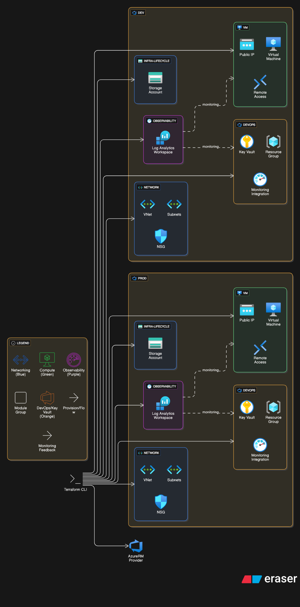

📘 Azure Infrastructure with Terraform

Modular IaC framework for provisioning and managing Azure cloud environments

🌍 Purpose

This project provides a modular Terraform framework to automate Azure infrastructure deployment.
It enables repeatable, secure, and environment-aware provisioning of core cloud resources — networking, compute, observability, security, and lifecycle management — for both development and production environments.

🚀 Key Features

DevOps Foundation – Creates resource groups, integrates with monitoring, and provisions Key Vault for secrets.

Infrastructure Lifecycle – Provides storage accounts and lifecycle management resources.

Networking – Deploys virtual networks, subnets, and security groups with rules for remote access.

Virtual Machines – Provisions VMs with public IPs, subnet attachment, and user access control.

Observability – Configures Azure Log Analytics Workspace for monitoring and logging.

Environment Separation – dev.tfvars and prod.tfvars for consistent multi-environment deployments.

Debugging Utilities – Helper scripts (.debug-dev.sh, .debug-prod.sh) for troubleshooting.

🛠 Tech Stack

Terraform (>=1.x)

AzureRM Provider

Azure CLI (for authentication)

Bash (for scripts)

📦 Installation & Setup
1️⃣ Clone the Repository
git clone https://github.com/jayWaikato/Azure_with_Terraform.git
cd Azure_with_Terraform

2️⃣ Install Prerequisites

Terraform

Azure CLI

Authenticate with Azure:

az login

3️⃣ Initialize Terraform

Pick a module, e.g., network:

cd network
terraform init

4️⃣ Apply Configurations

For dev:

terraform apply -var-file=env/dev.tfvars

For production:

terraform apply -var-file=env/prod.tfvars

📖 Usage Examples
Example: Deploy a VM
cd vm
terraform apply -var-file=env/dev.tfvars

Provisions a VM with public IP

Attaches to existing subnet (snet-bravo)

Configures remote access users

💡 Suggested diagram:
Terraform CLI → AzureRM Provider → Azure Cloud

Modules → Azure Services (VNet, NSG, VM, Key Vault, Storage, Log Analytics)

Debugging
./.debug-dev.sh
./.debug-prod.sh

🏗 Architecture
Root
 ├── devops/          # Resource groups, Key Vault, monitoring integration
 ├── infra-lifecycle/ # Storage accounts & lifecycle management
 ├── network/         # Virtual networks, subnets, NSGs
 ├── vm/              # VM provisioning with remote access
 ├── observability/   # Log Analytics Workspace
 └── env/             # Environment variables (dev/prod)