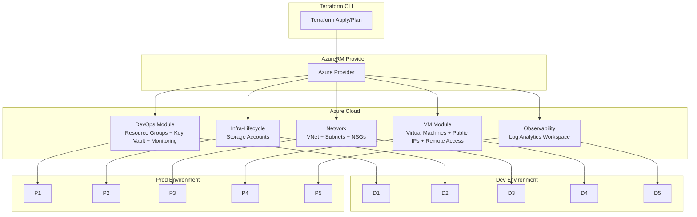

# 🌐 Azure Infrastructure with Terraform  
*Automated, modular, and environment-aware Infrastructure as Code (IaC) for Microsoft Azure*  

---

## 📖 Overview
This project provides a **modular Terraform framework** to deploy and manage core Azure infrastructure components.  
It is designed for **repeatability, scalability, and security** across multiple environments (Dev, Prod).  

---

## ✨ Key Features
- 🔐 **DevOps Module** → Resource Groups, Key Vault, Log Analytics integration  
- 📦 **Infra Lifecycle** → Storage Accounts and lifecycle resources  
- 🌍 **Networking** → Virtual Networks, Subnets, Network Security Groups  
- 💻 **Virtual Machines** → Public IP, subnet attachment, and remote access users  
- 📊 **Observability** → Log Analytics Workspace for monitoring and logging  
- ⚙️ **Environment Separation** → `dev.tfvars` and `prod.tfvars` for consistent deployments  
---

## 🛠 Tech Stack
- [Terraform](https://developer.hashicorp.com/terraform) (>=1.x)  
- [AzureRM Provider](https://registry.terraform.io/providers/hashicorp/azurerm/latest)  
- [Azure CLI](https://learn.microsoft.com/en-us/cli/azure/)  
- Bash (for scripts)  

---

## 🚀 Getting Started

### 1️⃣ Clone the Repository
```bash
git clone https://github.com/jayWaikato/Azure_with_Terraform.git
cd Azure_with_Terraform
```

### 2️⃣ Install Prerequisites
- Install **Terraform**  
- Install **Azure CLI**, then login:
  ```bash
  az login
  ```

### 3️⃣ Initialize Terraform
```bash
cd network    # or vm, observability, etc.
terraform init
```

### 4️⃣ Deploy Infrastructure
**Dev Environment**:
```bash
terraform apply -var-file=env/dev.tfvars
```

**Prod Environment**:
```bash
terraform apply -var-file=env/prod.tfvars
```

---

## 🖥 Usage Example – VM Deployment
```bash
cd vm
./.debug-dev.sh apply -var-file=env/dev.tfvars
```

This will:  
✔️ Create a VM with public IP  
✔️ Attach it to the `snet-bravo` subnet  
✔️ Configure remote access users  

---

## 🏗 Architecture Diagram



---

## 🔍 Scripts
```bash
./.debug-dev.sh
./.debug-prod.sh
```

---

## 🏅 Suggested Badges
(Add once CI/CD pipelines are integrated)  
-   
-   
-   

---
